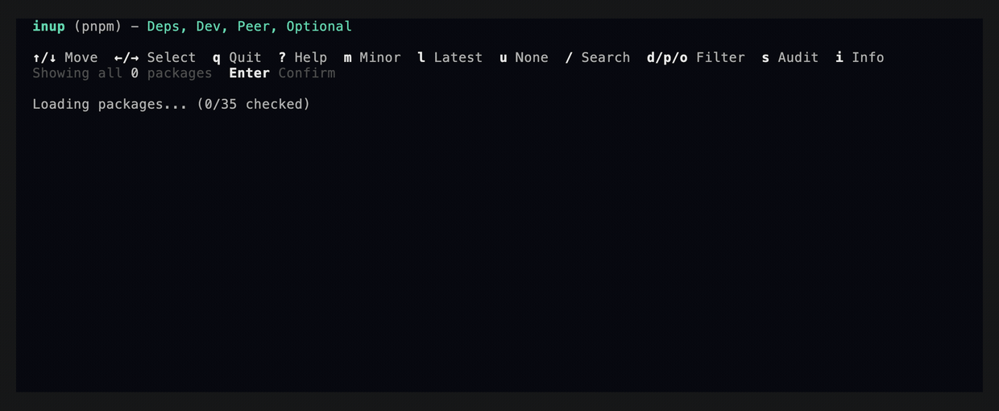

# inup — Interactive Dependency Upgrader

[](https://www.npmjs.com/package/inup)
[](https://www.npmjs.com/package/inup)
[](https://www.npmjs.com/package/inup)
[](https://github.com/donfear/inup/actions/workflows/ci.yml)
[](https://github.com/donfear/inup/blob/main/LICENSE)

Interactively upgrade outdated dependencies across npm, yarn, pnpm, and bun. Auto-detects your package manager, works in monorepos and workspaces, and requires zero configuration.



## Quick Start

```bash
npx inup
```

Or install globally with your preferred package manager:

```bash
npm install -g inup
pnpm add -g inup
yarn global add inup
bun add -g inup
```

Run `inup` in any project — it scans for outdated packages and lets you pick what to upgrade.

## Why inup?

- **All Dependencies at Once** — Dev, peer, and optional dependencies load automatically. No more re-running with `--peer` or `--dev` flags.
- **Live Toggles** — Filter dependency types (`d`, `p`, `o`) on the fly without restarting.
- **Zero Config** — Auto-detects npm, yarn, pnpm, or bun from your lockfile.
- **Monorepo Ready** — Discovers and upgrades across workspaces seamlessly.
- **Vulnerability Audit** — Flags known security vulnerabilities right in the package list so you know what's risky before upgrading.
- **Changelog Viewer** — Read release notes and changelogs inline without leaving the terminal.
- **Built-in Search** — Press `/` to filter packages instantly.
- **Package Details** — Press `i` to view package info, download stats, and more.
- **Themes** — Press `t` to switch between color themes.

## Options

```bash
inup [options]

-d, --dir <path>              Run in specific directory
-e, --exclude <patterns>      Skip directories (comma-separated regex)
-i, --ignore <packages>       Ignore packages (comma-separated, glob supported)
--max-depth <number>          Maximum scan depth for package discovery (default: 10)
--package-manager <name>      Force package manager (npm, yarn, pnpm, bun)
--json                        Print a machine-readable JSON report and exit (read-only)
-c, --check                   Exit non-zero if updates exist, without writing (for CI)
--apply                       Non-interactively write upgrades + install (for CI/automation)
--target <level>              With --apply: how far to bump — minor (default) | patch | latest
--debug                       Write verbose debug logs
```

## CI & Scripting

`inup` runs headless automatically when stdout isn't a TTY or `$CI` is set, so it never hangs in a
pipeline waiting on the interactive UI. Both `--json` and `--check` are **read-only** — they report,
they never edit `package.json` or install.

```bash
inup --check                 # exit 1 if anything is outdated → fails the build
inup --json | jq             # structured drift report for dashboards/bots
inup | cat                   # plain line-based report when piped to a log
inup --apply                 # write safe in-range bumps + install (non-interactive)
inup --apply --target latest # include major bumps; --json to also emit the report
```

Unlike `--json` and `--check`, **`--apply` writes**: it bumps `package.json` and runs your package
manager's install to update the lockfile. By default (`--target minor`) it only applies **in-range**
updates and leaves majors for you to review; `--target latest` includes majors. It honors `.inuprc`
(`ignore`, `exclude`, `scanDirs`) exactly as the report does — a package the config excludes is
never written. With `--apply --json`, the install output goes to stderr so stdout stays pure JSON.

Each reported package carries its health signals: `deprecated` (npm deprecation message), `enginesNode`
(declared `engines.node`), and `vulnerability` (known advisories on the currently-installed version,
from one bulk `npm audit`-style request). Every advisory is **cross-referenced against the upgrade
targets**, so you know whether the upgrade actually fixes it:

- `vulnerability.advisories[].fixedByRange` / `fixedByLatest` — does the in-range / latest target escape
  this advisory's affected range?
- `vulnerability.fixedByRange` / `fixedByLatest` — does the target clear **every** advisory?

The summary includes a `vulnerable` count, and the payload carries a `schemaVersion` so scripts and
agents can pin to a known shape.

Output hygiene: with `--json`, stdout carries **only** the JSON document; all progress and warnings go
to stderr. Exit codes: `0` up to date, `1` updates exist (`--check`), `2` error.

## GitHub Action — one rolling upgrade PR

Run inup on a schedule and get **one rolling pull request** with safe upgrades applied and a digest of
what changed — including, for each known vulnerability, whether the in-range bump already clears it or
only the major does. Re-runs update the same PR instead of opening new ones.

It's not trying to out-configure Dependabot or Renovate. It's the calm option: a single readable PR,
on your cadence, that tells you what's safe and what fixes a CVE.

Add this workflow to **your** repo:

```yaml
# .github/workflows/inup.yml
name: inup
on:
  schedule:
    - cron: '0 6 * * *' # daily at 06:00 UTC
  workflow_dispatch: {}

permissions:
  contents: write
  pull-requests: write

jobs:
  upgrade:
    runs-on: ubuntu-latest
    steps:
      - uses: actions/checkout@v4
      - uses: donfear/inup@v1
        with:
          target: minor # minor (default) | patch | latest
```

| Input | Default | Description |
|---|---|---|
| `target` | `minor` | How far to bump: `minor` (in-range), `patch`, or `latest` (includes majors). |
| `directory` | `.` | Directory to run in. |
| `package-manager` | _(auto)_ | Force `npm`/`yarn`/`pnpm`/`bun`; empty auto-detects from the lockfile. |
| `node-version` | `22` | Node.js version for the run (minimum `22.19`). |
| `inup-version` | `latest` | inup version to run (pin for reproducible runs). |
| `pr-branch` | `inup/dependency-upgrades` | Branch for the rolling PR. |
| `pr-title` | `chore(deps): dependency upgrades` | PR title. |
| `commit-message` | `chore(deps): upgrade dependencies via inup` | Commit message. |
| `base` | _(default branch)_ | Base branch the PR targets. |
| `labels` | `dependencies` | Labels to apply to the PR. |
| `token` | `${{ github.token }}` | Token to push + open the PR. |

Outputs: `outdated`, `vulnerable`, `pull-request-number`.

It honors your `.inuprc` (`ignore`, `exclude`, `scanDirs`), so packages and paths you exclude are
never touched.

> **CI on the upgrade PR:** PRs opened with the default `GITHUB_TOKEN` don't trigger other workflows.
> If you want CI to run on the upgrade PR, pass a [PAT](https://docs.github.com/actions/security-for-github-actions/security-guides/automatic-token-authentication#using-the-github_token-in-a-workflow)
> via the `token` input.

## Keyboard Shortcuts

<!-- KEYS:START -->
| Key | Action |
|-----|--------|
| `↑ / k` | Move up |
| `↓ / j` | Move down |
| `g` | Jump to the first package |
| `G` | Jump to the last package |
| `←` | Cycle selection left (none → range → latest) |
| `→` | Cycle selection right (none → range → latest) |
| `Space` | Toggle the current package on/off |
| `m` | Select all minor/patch updates |
| `l` | Select all latest updates (including major) |
| `u` | Unselect all packages |
| `Enter` | Confirm selection and upgrade |
| `/` | Search packages by name |
| `d` | Toggle devDependencies |
| `p` | Toggle peerDependencies |
| `o` | Toggle optionalDependencies |
| `s` | Run the vulnerability audit |
| `v` | Show only vulnerable packages |
| `Esc` | Clear the active search filter |
| `i` | View package details and changelog |
| `t` | Change the color theme |
| `?` | Show this help |
| `!` | Show the performance/debug panel |
<!-- KEYS:END -->

## Privacy

No tracking, no telemetry, no data collection. Package metadata is fetched directly from the npm registry. Download counts come from the npm downloads API. Changelog and release notes are fetched from GitHub.

## License

[MIT](LICENSE)
