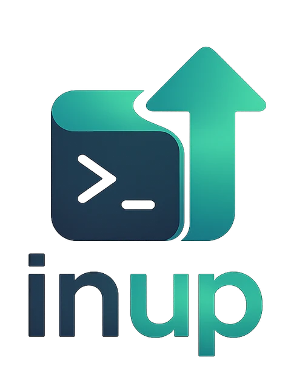

<p align="center">
  <a href="https://donfear.github.io/inup/"></a>
</p>

# inup — Interactive Dependency Upgrader

[](https://www.npmjs.com/package/inup)
[](https://www.npmjs.com/package/inup)
[](https://www.npmjs.com/package/inup)
[](https://github.com/donfear/inup/actions/workflows/ci.yml)
<!-- TEST-BADGES:START -->
[](https://github.com/donfear/inup/actions/workflows/ci.yml)
[](https://github.com/donfear/inup/actions/workflows/ci.yml)
<!-- TEST-BADGES:END -->
[](https://github.com/donfear/inup/blob/main/LICENSE)

**inup** is an interactive CLI for upgrading outdated npm dependencies — npm, yarn, pnpm, and bun all supported. It auto-detects your package manager, works in monorepos and workspaces, and requires zero configuration.

**[Documentation, comparisons & changelog →](https://donfear.github.io/inup/)**


## Table of Contents

- [Quick Start](#quick-start)
- [Why inup?](#why-inup)
- [Options](#options)
- [CI & Scripting](#ci--scripting)
- [GitHub Action — one rolling upgrade PR](#github-action--one-rolling-upgrade-pr)
- [Keyboard Shortcuts](#keyboard-shortcuts)
- [Privacy](#privacy)
- [License](#license)

## Quick Start

```bash
npx inup
```

Or install globally with your preferred package manager:

```bash
npm install -g inup
pnpm add -g inup
yarn global add inup
bun add -g inup
```

Run `inup` in any project — it scans for outdated dependencies and lets you pick what to upgrade.

> Requires Node 22.19+. Yes, an upgrade tool that asks you to upgrade first — we practice what we preach.

## Why inup?

The picker does more than `outdated` — every capability is a keystroke away:

<!-- FEATURES:START -->
- **Audit before you upgrade** — Known vulnerabilities appear next to each package, cross-referenced against the bump — so you know whether it actually clears the advisory.
- **Search the picker** — Filter hundreds of workspace dependencies as you type. / to search, Esc clears.
- **Live dependency-type toggles** — Show or hide dev, peer and optional dependencies on the fly — instead of restarting with different flags.
- **Changelogs in the terminal** — Read release notes inline before selecting a major. No browser tab, no guessing what changed.
- **Bulk select, precisely** — Select every safe in-range update with one key, or everything including majors — then deselect the risky ones.
- **Range or latest, per package** — Cycle each package between no upgrade, the in-range bump and the latest major. Mixed strategies in one pass.
<!-- FEATURES:END -->

And beyond the picker:

- **Zero config** — auto-detects npm, yarn, pnpm, or bun from your lockfile.
- **Monorepo & workspaces** — discovers and upgrades dependencies across every workspace in one pass.
- **pnpm catalogs** — dependencies declared as `catalog:` / `catalog:<name>` are resolved from `pnpm-workspace.yaml` and upgraded right there, preserving the file's comments and formatting.
- **Private registries** — honors your `.npmrc` (project, user, and global): scoped registries (`@scope:registry=…`) and credentials (`_authToken`, `username`/`_password`, `${ENV_VAR}` expansion), exactly like npm's own resolution.
- **Package details on demand** — press `i` for package info, download stats, and the changelog, inline.

## Options

```bash
inup [options]

-d, --dir <path>              Run in specific directory
-e, --exclude <patterns>      Skip directories (comma-separated regex)
-i, --ignore <packages>       Ignore packages (comma-separated, glob supported)
--max-depth <number>          Maximum scan depth for package discovery (default: 10)
--init                        Create a commented .inuprc template (asks before overwriting)
--package-manager <name>      Force package manager (npm, yarn, pnpm, bun)
--json                        Print a machine-readable JSON report and exit (read-only)
-c, --check                   Exit non-zero if updates exist, without writing (for CI)
--apply                       Non-interactively write upgrades + install (for CI/automation)
--target <level>              With --apply: minor (default, in-range) | patch (same major.minor) | latest
--save-exact                  Write exact versions instead of preserving the range prefix (^/~)
--no-color                    Disable colored output (also respects NO_COLOR / FORCE_COLOR)
--debug                       Write verbose debug logs
```

## CI & Scripting

Run inup non-interactively to gate builds on outdated or vulnerable dependencies, generate a
machine-readable dependency report, or auto-apply safe upgrades in CI/CD.

`inup` runs headless automatically when stdout isn't a TTY or `$CI` is set, so it never hangs in a
pipeline waiting on the interactive UI. Both `--json` and `--check` are **read-only** — they report,
they never edit `package.json` or install.

```bash
inup --check                 # exit 1 if anything is outdated → fails the build
inup --json | jq             # structured drift report for dashboards/bots
inup | cat                   # plain line-based report when piped to a log
inup --apply                 # write safe in-range bumps + install (non-interactive)
inup --apply --target latest # include major bumps; --json to also emit the report
```

<details>
<summary><strong>Details: <code>--apply</code>, JSON schema, and vulnerability cross-referencing</strong></summary>

Unlike `--json` and `--check`, **`--apply` writes**: it bumps `package.json` and runs your package
manager's install to update the lockfile. By default (`--target minor`) it only applies **in-range**
updates and leaves majors for you to review; `--target patch` stays within the current
`major.minor` line (patch bumps only); `--target latest` includes majors. It honors `.inuprc`
(`ignore`, `exclude`, `scanDirs`) exactly as the report does — a package the config excludes is
never written. With `--apply --json`, the install output goes to stderr so stdout stays pure JSON.

**pnpm catalogs work in every mode.** Dependencies declared as `catalog:` / `catalog:<name>` are
resolved from `pnpm-workspace.yaml`; `--apply` writes the new range back into that file (comments
and formatting preserved), and in `--json` output such entries carry a `"catalog"` field with their
`packageJsonPath` pointing at `pnpm-workspace.yaml`.

Each reported package carries its health signals: `deprecated` (npm deprecation message), `enginesNode`
(declared `engines.node`), and `vulnerability` (known advisories on the currently-installed version,
from one bulk `npm audit`-style request). Every advisory is **cross-referenced against the upgrade
targets**, so you know whether the upgrade actually fixes it:

- `vulnerability.advisories[].fixedByRange` / `fixedByLatest` — does the in-range / latest target escape
  this advisory's affected range?
- `vulnerability.fixedByRange` / `fixedByLatest` — does the target clear **every** advisory?

The summary includes a `vulnerable` count, and the payload carries a `schemaVersion` so scripts and
agents can pin to a known shape.

Output hygiene: with `--json`, stdout carries **only** the JSON document; all progress and warnings go
to stderr. Exit codes: `0` up to date, `1` updates exist (`--check`), `2` error.

</details>

## GitHub Action — one rolling upgrade PR

Automate dependency upgrades for your GitHub repo: run inup on a schedule and get **one rolling pull
request** with safe upgrades applied. Re-runs update the same PR instead of opening new ones.

Add this workflow to **your** repo:

```yaml
# .github/workflows/inup.yml
name: inup
on:
  schedule:
    - cron: '17 5 * * *' # daily around 05:17 UTC
  workflow_dispatch: {}

permissions:
  contents: write
  pull-requests: write

jobs:
  upgrade:
    runs-on: ubuntu-latest
    steps:
      - uses: actions/checkout@v4
      - uses: donfear/inup@v1
        with:
          target: minor # minor (default) | patch | latest
```

That's it. Also enable Settings → Actions → General → **Workflow permissions** →
**"Allow GitHub Actions to create and approve pull requests"** so the action can open the PR.

Scheduled workflows are not real-time timers. [GitHub documents](https://docs.github.com/actions/using-workflows/events-that-trigger-workflows#schedule)
that `schedule` runs can be delayed during busy periods; the start of each hour is especially busy,
and very high load can even drop queued scheduled runs. If you want upgrades ready by a specific time,
schedule inup earlier than you need it and avoid `:00` cron minutes. Otherwise, let the scheduled run
arrive when GitHub starts it; the action will still update the same rolling PR when it runs.

### What the action creates

When inup finds applicable upgrades, the workflow commits the changed manifest/lockfile and opens or
updates one pull request. The PR body looks like this:

```md
## 📦 Dependency upgrades

Scanned **18** packages — **3** unique upgrade(s) (1 with a major available, 1 with known vulnerabilities).

### ✅ Applied in this PR

- `eslint` `^9.28.0` → `^9.30.1` (devDependencies)
- `react` `^18.2.0` → `^18.3.1` (dependencies · catalog:default)
- `undici` `^7.10.0` → `^7.11.0` (dependencies)
- `vite` `^6.3.0` → `^6.3.5` (devDependencies)

### Updates

| Package | Current | → In-range | Latest | Type | Applied | Major? | Security |
|---|---|---|---|---|---|---|---|
| `eslint` | ^9.28.0 | ^9.30.1 | 9.30.1 | devDependencies | ✅ | — | — |
| `react` | ^18.2.0 | ^18.3.1 | 19.2.0 | dependencies · catalog:default | ✅ | ⚠️ yes | — |
| `undici` | ^7.10.0 | ^7.11.0 | 7.11.0 | dependencies | ✅ | — | 🟢 fixed by in-range bump |
| `vite` | ^6.3.0 | ^6.3.5 | 7.0.0 | devDependencies | ✅ | ⚠️ yes | — |
```

Catalog-sourced upgrades (pnpm `catalog:` deps) are applied to `pnpm-workspace.yaml` and marked
`catalog:<name>` in the PR body so reviewers know which file the diff touches.

<details>
<summary><strong>Details: commit attribution, all inputs, and outputs</strong></summary>

### Commit as you, not the bot

By default the upgrade commit is authored by `github-actions[bot]`. To attribute it to **you**, store
your name/email as repo secrets (Settings → Secrets and variables → Actions) and pass `committer`/`author`:

```yaml
      - uses: donfear/inup@v1
        with:
          committer: ${{ secrets.GH_USERNAME }} <${{ secrets.GH_EMAIL }}>
          author: ${{ secrets.GH_USERNAME }} <${{ secrets.GH_EMAIL }}>
```

### All inputs

| Input | Default | Description |
|---|---|---|
| `target` | `minor` | How far to bump: `minor` (in-range), `patch`, or `latest` (includes majors). |
| `directory` | `.` | Directory to run in. |
| `package-manager` | _(auto)_ | Force `npm`/`yarn`/`pnpm`/`bun`; empty auto-detects from the lockfile. |
| `node-version` | `22` | Node.js version for the run (minimum `22.19`). |
| `inup-version` | `latest` | inup version to run (pin for reproducible runs). |
| `pr-branch` | `inup/dependency-upgrades` | Branch for the rolling PR. |
| `pr-title` | `chore(deps): dependency upgrades` | PR title. |
| `commit-message` | `chore(deps): upgrade dependencies via inup` | Commit message. |
| `base` | _(default branch)_ | Base branch the PR targets. |
| `labels` | `dependencies` | Labels to apply to the PR. |
| `token` | `${{ github.token }}` | Token to push + open the PR. Pass a PAT to also trigger CI on the PR. |
| `committer` | `github-actions[bot]` | Commit committer, as `Name <email>`. |
| `author` | _(triggering user)_ | Commit author, as `Name <email>`. |

Outputs: `outdated`, `vulnerable`, `pull-request-number`.

> `@v1` floats to the latest `1.x` release; pin to `@v1.6.2` or a SHA for reproducible runs. inup
> honors your `.inuprc` (`ignore`, `exclude`, `scanDirs`).

</details>

## Keyboard Shortcuts

<!-- KEYS:START -->
| Key | Action |
|-----|--------|
| `↑ / k` | Move up |
| `↓ / j` | Move down |
| `g` | Jump to the first package |
| `G` | Jump to the last package |
| `←` | Cycle selection left (none → range → latest) |
| `→` | Cycle selection right (none → range → latest) |
| `Space` | Toggle the current package on/off |
| `m` | Select all minor/patch updates |
| `l` | Select all latest updates (including major) |
| `u` | Unselect all packages |
| `Enter` | Confirm selection and upgrade |
| `/` | Search packages by name |
| `d` | Toggle devDependencies |
| `p` | Toggle peerDependencies |
| `o` | Toggle optionalDependencies |
| `s` | Run the vulnerability audit |
| `v` | Show only vulnerable packages |
| `Esc` | Clear the active search filter |
| `i` | View package details and changelog |
| `t` | Change the color theme |
| `?` | Show this help |
| `!` | Show the performance/debug panel |
<!-- KEYS:END -->

## Privacy

No tracking, no telemetry, no data collection. Package metadata is fetched directly from the npm registry, download counts from the npm downloads API, and changelogs/release notes from GitHub.

## License

[MIT](LICENSE)
